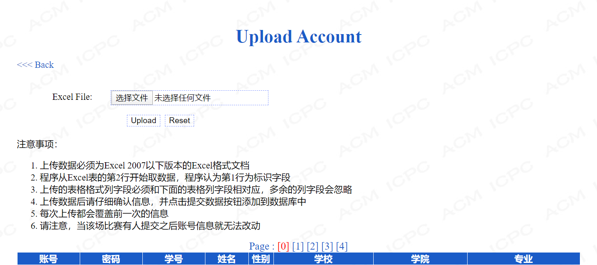
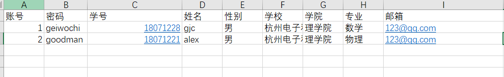
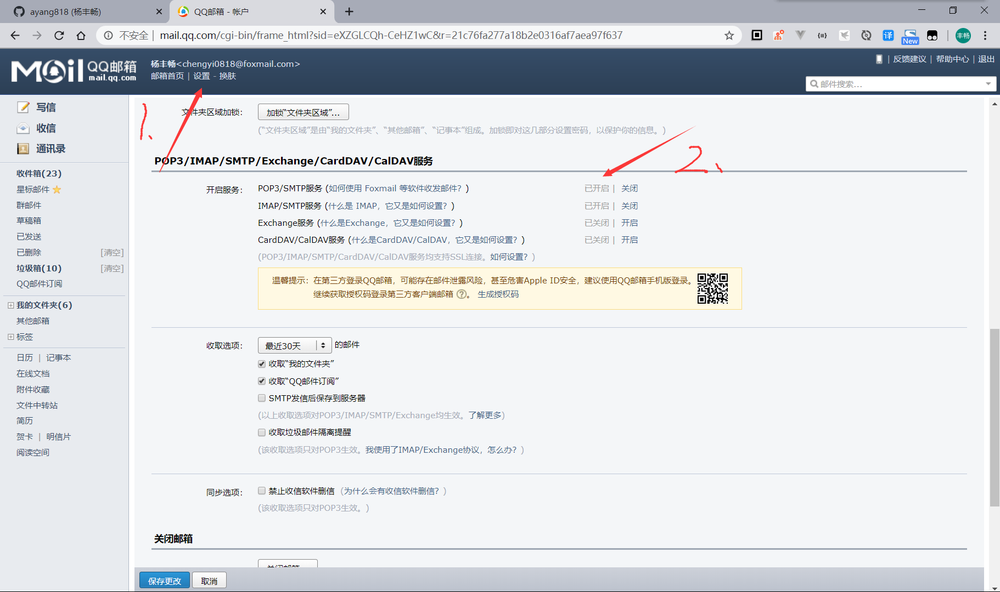
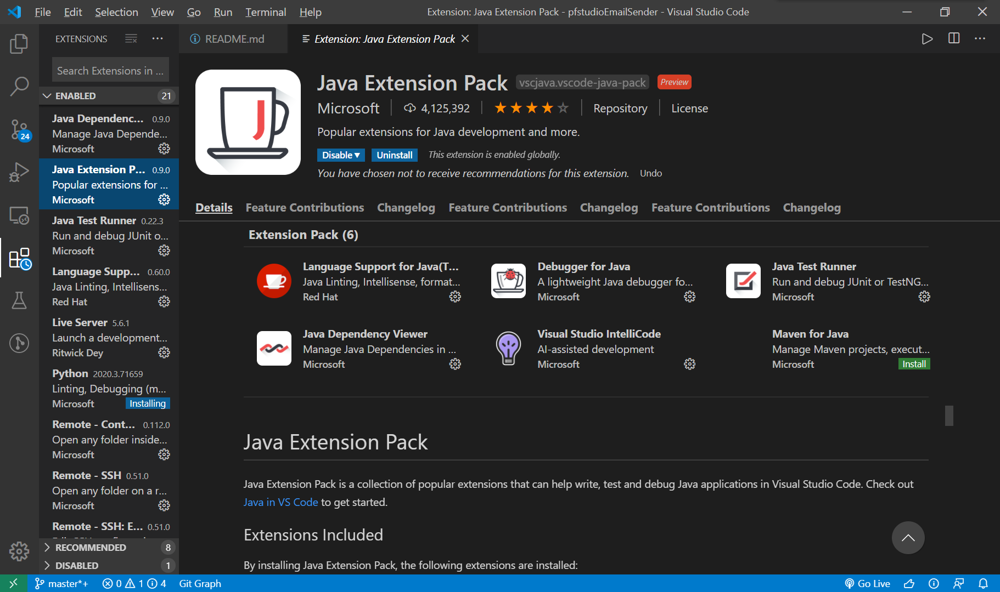
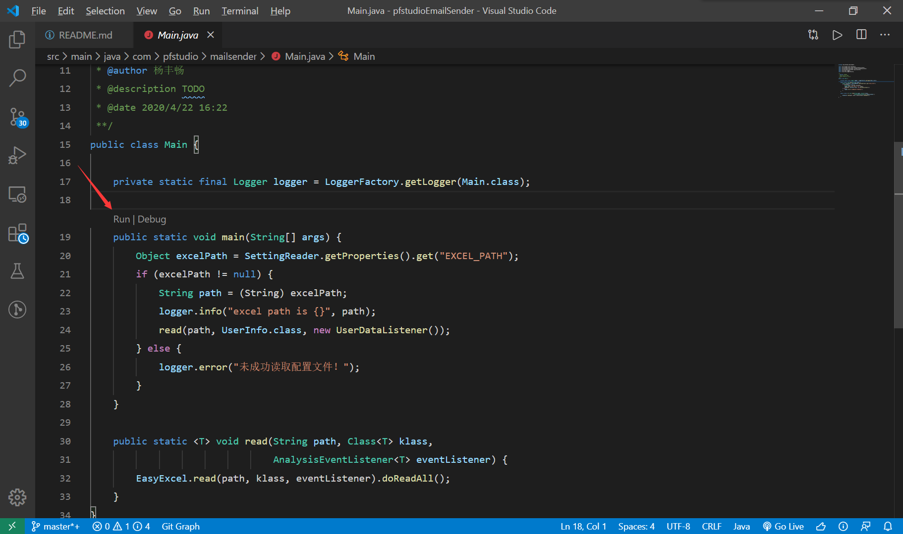

# PfstudioEmailSender

> 背景：每年五月份左右，杭州电子科技大学理学院就会举行 第 X 届攀峰杯程序设计竞赛，这个时候我们就需要做邮件消息通知这一繁琐的工作。

## 功能
在 [HDOJ](http://acm.hdu.edu.cn/) 上开一个 private 的比赛需要上传一个符合下图要求的excel 

我们做的就是提取 excel 中的账号，密码，发送到参赛者对应的邮箱中。

## 环境依赖
1. JDK 1.8
2. Maven3
3. vscode 或 idea

## 如何使用

1. 创建符合以下格式的 excel（由于 HDOJ 会忽略我们多出来的列，所以这个 excel 也可以直接用于比赛的账户导入）。

2. 开启你的QQ邮箱的 FMTP 服务，按照下图操作后你会得到一个授权码。

3. 按照要求编辑项目路径中 `src/main/resources/application.properties` 配置文件。

4. IDEA 运行该项目非常简单（如果不清楚，可以自行使用搜索引擎搜索，IDEA导入maven项目），这里不细说；如果你不想下载IDEA，使用vscode1也可以很容易地跑起来。首先安装 Java Extenion Package。

然后打开 `src/main/java/com/pfstudio/mailsender/Main.java` 点击下图按钮，运行main函数即可
